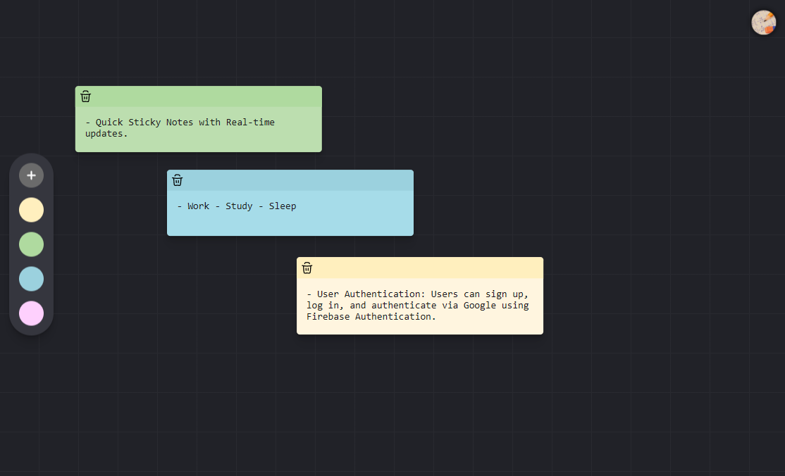

# Dragnotes

## Project Overview

DragNotes is a dynamic web application designed to provide users with a simple, intuitive platform for creating, managing, and organizing sticky notes. Utilizing React for the frontend and Firebase for backend services, this app allows users to seamlessly create, edit, delete, and drag notes across their workspace.

## Preview



## Features

-   **User Authentication**: Users can sign up, log in, and authenticate via Google using Firebase Authentication.
-   **Notes Management**:
    1. Create, edit, delete, and drag sticky notes.
    2. Notes are saved in real-time using Firebase Firestore.
    3. Notes are persistent and accessible from any device upon login.
-   **Real-Time Updates**: Notes data is updated in real-time without the need for manual page refreshes.
-   **Drag-and-Drop Interface**: Intuitive drag-and-drop interface for easy note organization.
-   **Responsive Design**: Responsive layout, ensuring a seamless experience on both desktop and mobile devices.

## Tech Stack

-   **Frontend**: React, CSS for styling, Typescript
-   **Database**: Firebase
-   **State Management**: React Context
-   **Build Tools**: Vite, TypeScript

## Getting Started

### Prerequisites

Make sure you have the following installed:

-   [Node.js](https://nodejs.org/) (v14 or later)
-   [npm](https://www.npmjs.com/) (v6 or later) or [Yarn](https://yarnpkg.com/) (v1 or later)

### Installation

1. Clone the repository:

    ```bash
    git clone https://github.com/skies-codes/dragnotes.git
    cd dragnotes
    ```

2. Install the dependencies:

    ```bash
    npm install
    # or
    yarn install
    ```

### Running the Development Server

To start the development server, run:

```bash
npm run dev
# or
yarn dev
```

This will start the Vite development server and you can view the application at `http://localhost:5173`.

### Building for Production

To build the project for production, run:

```bash
npm run build
# or
yarn build
```

The output will be in the `dist` directory.

## Project Structure

```plaintext
spotify-recommendation-engine/
├── public/              # Static assets
├── src/
│   ├── assets/          # Images, fonts, etc.
│   ├── components/      # Reusable components
|   ├── context/         # React Context
|   ├── firebase/        # Firebase config and actions
|   ├── icons/           # Icon components
│   ├── pages/           # All pages
│   ├── types/           # Types and Interfaces
│   ├── utils/           # Utility functions
│   ├── App.tsx          # Root component
│   ├── index.css        # Root styles
│   ├── main.tsx         # Entry point
├── .env.example         # .env.local (change to this)
├── .eslintrc.cjs        # ESLint configuration
├── tsconfig.json        # TypeScript configuration
├── vite.config.ts       # Vite configuration
└── package.json         # Project metadata and scripts
```

## License

This project is licensed under the MIT License. See the [LICENSE](LICENSE) file for details.

---

Happy coding! 🎵
<br>
@skies-codes
